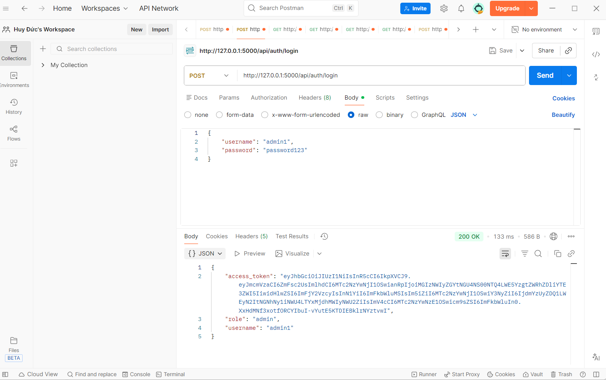
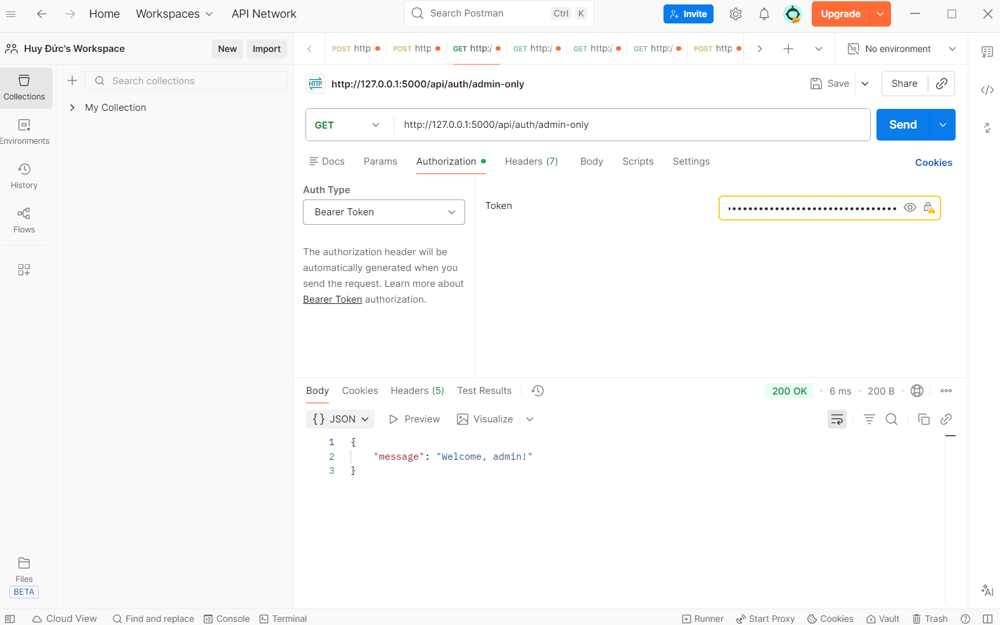
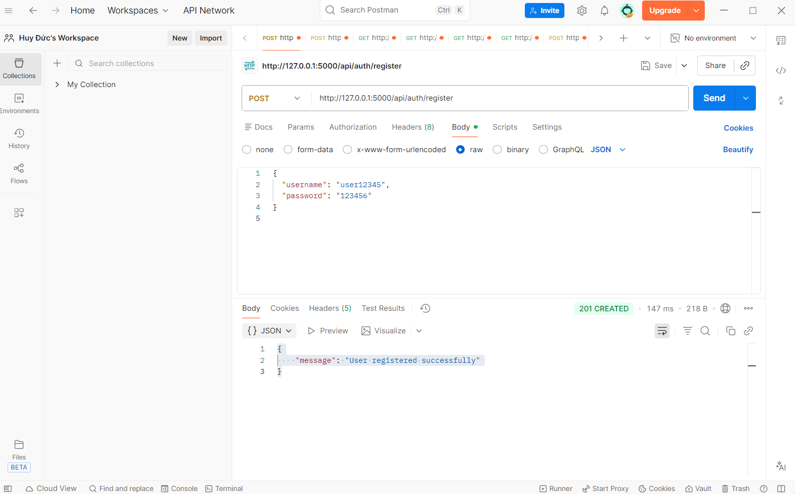
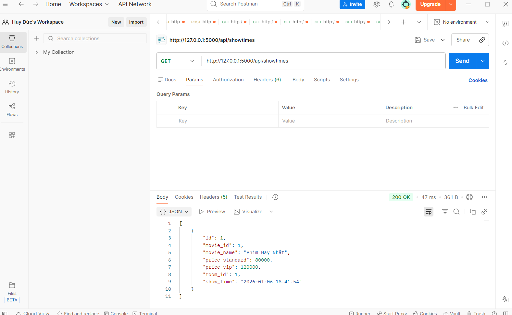
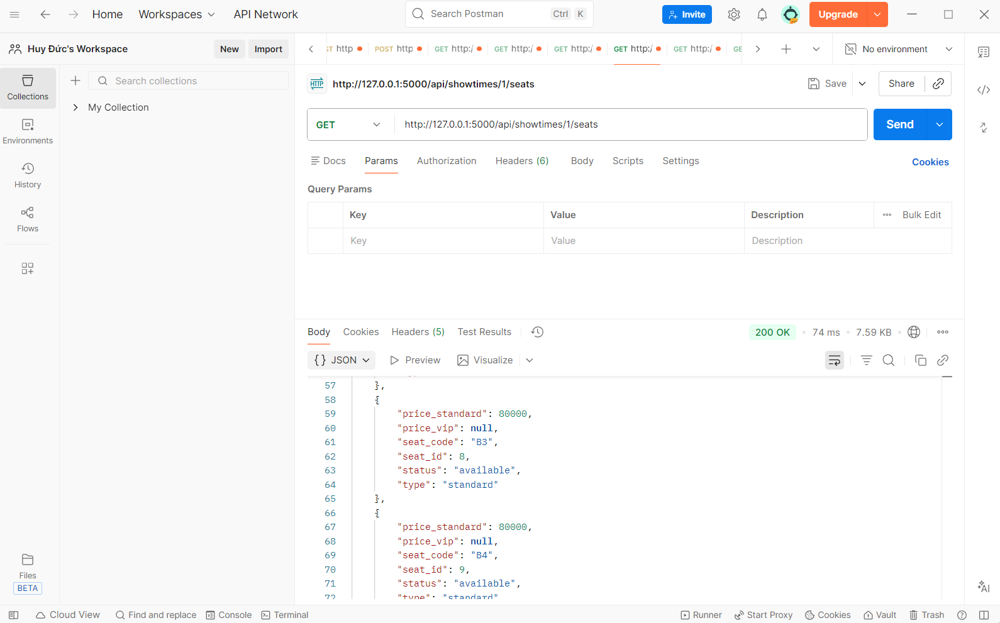

# 🎬 Cinema Backend API

## 📌 Giới thiệu

Cinema Backend API là hệ thống backend cho website xem phim và đặt vé, cung cấp các RESTful API phục vụ quản lý phim, rạp chiếu, suất chiếu và người dùng.

Dự án được thực hiện trong quá trình học tập và làm bài tập lớn, mục tiêu rèn luyện kỹ năng backend, thiết kế API và làm việc với cơ sở dữ liệu.

---

## 🛠 Công nghệ sử dụng

- Python
- Flask
- Flask SQLAlchemy
- MySQL
- JWT Authentication
- Postman (test API)

---

## 📂 Chức năng chính

- Đăng ký / đăng nhập người dùng
- Quản lý phim (CRUD)
- Quản lý rạp chiếu & phòng chiếu
- Quản lý suất chiếu
- Đặt vé xem phim
- Phân quyền người dùng (Admin / User)

---

## ⚙️ Cài đặt & chạy project

### 1. Clone project

```bash
git clone https://github.com/huynhyuddi/Cinema_Backend.git
cd Cinema_Backend
```

### 2. Tạo môi trường ảo

```bash
python -m venv venv
venv\Scripts\activate
```

### 3. Cài đặt thư viện

```bash
pip install -r requirements.txt
```

### 4. Cấu hình database

-Cấu hình thông tin database trong file config.py hoặc .env

-Ví dụ: host, username, password, database name

### 5. Chạy server

```bash
python app.py
```

### 6. 🧪 Test API

-Sử dụng Postman để test các API

-API được thiết kế theo chuẩn REST

-Thực hiện CRUD cho các tài nguyên chính (phim, rạp, suất chiếu)

## API Testing Screenshots

### Login API



### Admin_only API



### Register API



### Showtime API



### Seat API



### 👤 Author

Huy Lê – Sinh viên năm 3, Khoa học máy tính
